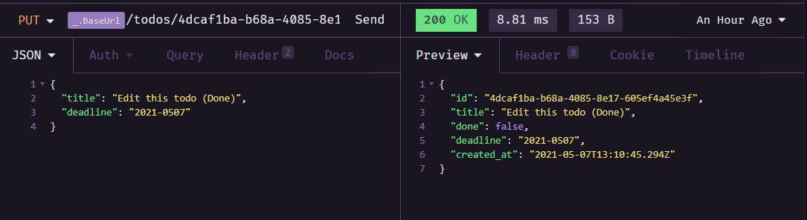

# To Dos List

```
Este é um desáfio que estou cumprido para o ignite, um bootcamp da Rocketseat, o objetivo é fazer uma API que cumpra os requisitos necessários mínimos para fazer uma lista ToDos
```
----
## Requirements

* [x] Deve ser possível criação de usuários com `name` e `username`
* [x] CRUD completo dos `ToDos`
> * [x] Criar um Novo ToDo
> * [x] Listar todos os ToDos
> * [x] Alterar `title` e o `deadline` de um ToDo existente
> * [x] Marcar um ToDo como feito
> * [x] Excluir um ToDo

obs: `username deve ser passado pelo header`

----
## Primeiros passos

Em primeiro lugar é necessário que você faça um um clone desse repositório em sua máquina, para fazer isso é necessário ter o git instalado na sua máquin ( caso não tenha use esse [link](https://git-scm.com/) e faça o download ), depois de ter o git instalado abra o terminal e digite o seguinte comando `git clone https://github.com/ArturHamannRonconi/Desafio01-ignite-to-dos-list.git`.

Agora que você ja tem o repositório clonado em sua máquina lembre-se de dar o comando `yarn` em seu terminal ( caso não tenha use esse [link](https://yarnpkg.com/) e faça o download ) para baixar todas as depêndencias necessárias.

Antes de começar a usar você vai precisar baixar o [insomnia](https://insomnia.rest/download) ou você pode utilizar o [postman](https://www.postman.com/), um deles ajudará você a utilizar a API sem a necessidade de escrever códigos para obter os resultados

## Como usar?

Agora que você já tem tudo necessário podemos finalmente começar,
inicie seu servidor com `yarn dev` e agora será necessário criar um usuário come um `name` e um `username` para isso eu estou usando o [insomnia](https://insomnia.rest/download).

* ## Criar Usuário
envie um json com os atributos `name` e `username` para `/users` utilizando o método `POST` dessa forma


você obterá um resultado parecido com esse.


* ## Criar `ToDo`
Depois de ter seu usuário feito você pode começar a fazer seus `ToDos`, crie outra requisição do tipo
`POST` para `/todos` com um dois atributos em seu body e um no header, faça `title` e `deadline` para o body e `username` para headers


----


o resultado deve vir dessa forma.


* ## Ver seus `ToDos`
Para poder ver todos os seus `ToDos` faça uma requisição do tipo `GET` para `/todos` enviando apenas seu `username` pelo header como feito 
anteriormente, o resultado virá dessa foroma


* ## Listar Como `Feito`

Caso você queira listar seu `ToDo` como feito crie mais uma requisição mas dessa vez do tipo `PATCH` para `/todos/{ID do ToDo}/done` e novamente coloque o seu `username` no header, o seu resultado deve vir algo parecido com isso.


* ## Alterar o `title` ou `deadline`

Para mudar esses atributos será necessário uma requisição do tipo `PUT` para `/todos/{ID do ToDo}`, e dessa vez além de enviar o `username` pelo header envie também `title` e `deadline` com os novos valores pelo body, ficará dessa forma.




* ## Deletar `ToDo`

Por último mas não menos importante você pode deletar seu `ToDo`, use uma requisição do tipo `DELETE` para `/todos/{ID do ToDo}` e também envie seu `username` pelo header, sua resposta deverá vir dessa maneira.

